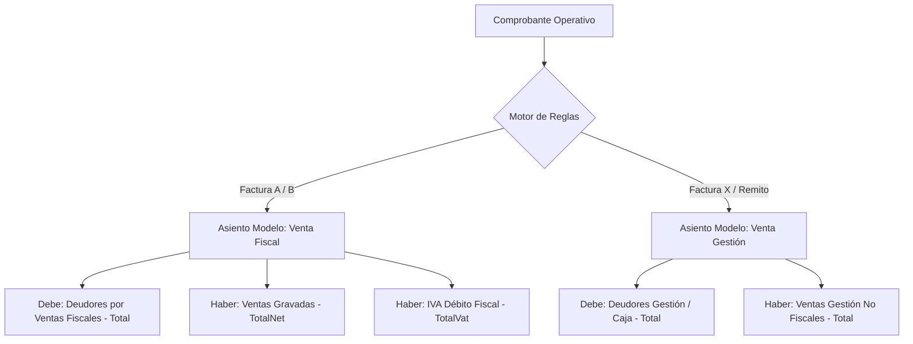

# 📘 Propuesta Técnica y Funcional: Motor de Asientos Modelos y Variables Financieras
**Sistema:** Leal Control ERP v2  
**Fecha:** 24/08/2026  
**Destinatario:** Área Contable / Asesoría en Ciencias Económicas  
**Objetivo:** Validar la arquitectura contable, el catálogo de variables financieras y la automatización de asientos modelos para compras, ventas (fiscales y de gestión), tesorería, sueldos y stock.

---

## 1. Fundamento y Enfoque Contable

En la operativa diaria de una empresa coexisten dos requerimientos contables fundamentales:

1. **Contabilidad Fiscal / Legal (Libro Diario Oficial / ARCA - AFIP)**:
   - Registra comprobantes con validez impositiva (Facturas A, B, C, M, Notas de Crédito/Débito, Recibos Oficiales).
   - Genera Libros IVA Ventas e IVA Compras, saldos de IVA Débito/Crédito Fiscal y regímenes de retención/percepción.
2. **Contabilidad de Gestión / Auditoría Interna (Control Real de Caja, Deudores y Stock)**:
   - Para que la **Caja Real**, el **Inventario Físico (CMV)** y la **Cuenta Corriente Comercial** cuadren con exactitud en auditoría, el sistema debe registrar también comprobantes de gestión interna (Facturas X, remitos valorizados, recibos provisorios).
   - **Solución implementada:** Se asignan a **cuentas contables diferenciadas** (ej. *Ventas Gestión* vs. *Ventas Gravadas*, *Deudores Comerciales Gestión* vs. *Deudores Fiscales*) y se permite filtrar los reportes en modo **"Solo Fiscal"** o **"Consolidado de Gestión"**.

---

## 2. Funcionamiento de los Asientos Modelos (Plantillas)

Un **Asiento Modelo** define la regla contable para automatizar la registración de un lote de comprobantes con un solo clic.

Cada renglón del asiento modelo vincula:
- Una **Cuenta Contable** del Plan de Cuentas.
- Si imputa al **Debe** o al **Haber**.
- Una **Variable Financiera Dinámica** que extrae el importe exacto del comprobante.

---

## 3. Catálogo de Variables Financieras Propuestas

A continuación se detalla la nómina de variables dinámicas disponibles para armar las plantillas:

### 📁 A. Ventas y Facturación (`Sales`)
| Variable | Descripción / Concepto | Destino Típico |
| :--- | :--- | :--- |
| `Total` | Importe total bruto del comprobante | Deudores por Ventas / Clientes |
| `TotalNet` | Suma de subtotales netos gravados | Ventas Gravadas |
| `Net21`, `Net105`, `Net27` | Neto gravado discriminado por alícuota de IVA | Ventas por Alícuota |
| `NetExempt` | Importe neto exento o no gravado | Ventas Exentas |
| `TotalVat` | Suma total de IVA liquidado | IVA Débito Fiscal |
| `Vat21`, `Vat105`, `Vat27` | IVA liquidado por alícuota | IVA Débito 21% / 10.5% |
| `PerceptionIibb` | Percepción de Ingresos Brutos liquidada | Percepciones IIBB a Pagar |
| `PerceptionVat` | Percepción de IVA liquidada | Percepciones IVA a Pagar |
| `PerceptionEarnings` | Percepción de Ganancias liquidada | Percepciones Ganancias a Pagar |
| `InternalTaxes` | Impuestos internos o tasas municipales | Impuestos Internos a Pagar |
| `CmvCost` | Costo de mercadería vendida según lista/valuación | Costo de Mercaderías Vendidas |

### 📁 B. Compras y Gastos (`Purchases`)
| Variable | Descripción / Concepto | Destino Típico |
| :--- | :--- | :--- |
| `Total` | Importe total de la factura de proveedor | Proveedores / Cuentas por Pagar |
| `TotalNet` | Subtotal neto gravado de la compra | Mercaderías / Gastos Generales |
| `TotalVat` | Suma de IVA liquidado por el proveedor | IVA Crédito Fiscal |
| `Vat21`, `Vat105`, `Vat27` | IVA Crédito Fiscal por alícuota | IVA Crédito 21% / 10.5% |
| `PerceptionIibb` | Percepción de IIBB sufrida en la compra | Retenciones/Percepciones IIBB (Activo) |
| `PerceptionVat` | Percepción de IVA sufrida | Percepciones IVA (Activo) |
| `PerceptionEarnings` | Percepción de Ganancias sufrida | Percepciones Ganancias (Activo) |
| `NonComputableVat` | IVA no computable / Gastos sin cómputo fiscal | Cuenta de Gasto Directo |

### 📁 C. Tesorería, Cobranzas y Pagos (`Finance`)
| Variable | Descripción / Concepto | Destino Típico |
| :--- | :--- | :--- |
| `ReceiptTotal` | Total cobrado o pagado | Deudores por Ventas / Proveedores |
| `CashAmount` | Importe percibido/entregado en Efectivo | Caja Pesos / Moneda Local |
| `BankTransferAmount` | Importe por transferencia bancaria | Banco Cta. Cte. / Banco Caja de Ahorro |
| `EcheqAmount` | Cheques de terceros o propios | Valores a Depositar / Cheques de Pago Diferido |
| `WithholdingIibb` | Retención de IIBB sufrida/practicada | Retenciones IIBB a Favor / a Depositar |
| `WithholdingVat` | Retención de IVA sufrida/practicada | Retenciones IVA a Favor / a Depositar |
| `WithholdingEarnings` | Retención de Ganancias sufrida/practicada | Retenciones Ganancias a Favor / a Depositar |
| `WithholdingSuss` | Retención de Seguridad Social (SUSS) | Retenciones SUSS |
| `EarlyPaymentDiscount` | Descuento financiero por pronto pago | Descuentos Obtenidos / Concedidos |
| `ExchangeDifference` | Diferencia de cambio en moneda extranjera | Diferencia de Cambio (+ / -) |

### 📁 D. Stock e Inventarios (`Inventory`)
| Variable | Descripción / Concepto | Destino Típico |
| :--- | :--- | :--- |
| `StockCost` | Valor total de salida/entrada de inventario | Mercaderías de Reventa / Materias Primas |
| `StockAdjustmentGain` | Sobrante de stock valorizado | Ganancia por Ajuste de Inventario |
| `StockAdjustmentLoss` | Faltante o merma de inventario | Pérdida por Ajuste de Inventario |

### 📁 E. Sueldos y Cargas Sociales (`Payroll`)
| Variable | Descripción / Concepto | Destino Típico |
| :--- | :--- | :--- |
| `GrossSalary` | Total de haberes brutos devengados | Sueldos y Jornales (Pérdida) |
| `EmployeeDeductions` | Retenciones al empleado (Jubilación, OS, Ley 19032) | Aportes y Contribuciones a Depositar |
| `NetSalaryToPay` | Neto a transferir a los empleados | Sueldos a Pagar (Pasivo) |
| `EmployerContributions` | Contribuciones patronales empresa (SUSS F.931) | Cargas Sociales (Pérdida) |
| `ArtInsurance` | Seguro ART | ART a Pagar / Pérdida |

---

## 4. Ejemplos de Asientos Modelos Sugeridos

### Modelo 1: Factura de Venta "A" (Fiscal)
- **Módulo:** Ventas | **Comprobante:** Facturas A / M
- **Renglones:**
  1. `[Debe]` **1.1.2.01 - Deudores por Ventas** → Variable: `Total`
  2. `[Haber]` **4.1.1.01 - Ventas de Bienes y Servicios** → Variable: `TotalNet`
  3. `[Haber]` **2.1.1.01 - IVA Débito Fiscal** → Variable: `TotalVat`
  4. `[Haber]` **2.1.1.03 - Percepciones IIBB a Pagar** → Variable: `PerceptionIibb` *(opcional si aplica)*

### Modelo 2: Comprobante de Venta "X" / Interno (Gestión)
- **Módulo:** Ventas | **Comprobante:** Factura X / Remito Valorizado
- **Renglones:**
  1. `[Debe]` **1.1.2.02 - Deudores Cuenta Corriente Gestión** → Variable: `Total`
  2. `[Haber]` **4.1.1.05 - Ventas Gestión Operativa** → Variable: `Total`
  *(No discrimina IVA Débito ni percepciones fiscales).*

### Modelo 3: Factura de Compra "A" (Proveedor)
- **Módulo:** Compras | **Comprobante:** Factura A Proveedor
- **Renglones:**
  1. `[Debe]` **1.1.3.01 - Mercaderías / Gastos Gravados** → Variable: `TotalNet`
  2. `[Debe]` **1.1.4.01 - IVA Crédito Fiscal** → Variable: `TotalVat`
  3. `[Debe]` **1.1.4.03 - Percepciones IIBB Sufridas** → Variable: `PerceptionIibb`
  4. `[Haber]` **2.1.2.01 - Proveedores Comerciales** → Variable: `Total`

### Modelo 4: Cobranza Comercial con Cheque, Retenciones y Descuento
- **Módulo:** Tesorería / Finanzas | **Comprobante:** Recibo de Cobranza
- **Renglones:**
  1. `[Debe]` **1.1.1.02 - Valores a Depositar (Cheques)** → Variable: `EcheqAmount`
  2. `[Debe]` **1.1.1.01 - Caja Efectivo** → Variable: `CashAmount`
  3. `[Debe]` **1.1.4.05 - Retenciones Ganancias Sufridas** → Variable: `WithholdingEarnings`
  4. `[Debe]` **1.1.4.06 - Retenciones IIBB Sufridas** → Variable: `WithholdingIibb`
  5. `[Debe]` **5.1.2.01 - Descuentos Concedidos** → Variable: `EarlyPaymentDiscount`
  6. `[Haber]` **1.1.2.01 - Deudores por Ventas** → Variable: `ReceiptTotal`

### Modelo 5: Liquidación de Sueldos y Cargas Sociales (F.931)
- **Módulo:** Sueldos y Jornales | **Comprobante:** Liquidación Mensual
- **Renglones:**
  1. `[Debe]` **5.2.1.01 - Sueldos y Jornales** → Variable: `GrossSalary`
  2. `[Debe]` **5.2.1.02 - Cargas Sociales Patronales** → Variable: `EmployerContributions`
  3. `[Haber]` **2.1.3.01 - Sueldos a Pagar** → Variable: `NetSalaryToPay`
  4. `[Haber]` **2.1.3.02 - Cargas Sociales a Depositar (AFIP/SUSS)** → Variable: `EmployeeDeductions + EmployerContributions`

---

## 5. Preguntas de Validación para el Profesional Contable

Para dejar configurado el módulo a medida de la empresa, agradecemos su opinión sobre:

1. **Nomenclatura de Cuentas de Gestión**: ¿Prefiere que las ventas no fiscales se imputen a una cuenta `4.1.1.05 - Ventas Gestión / Internas` o prefiere separar por sucursal/unidad de negocio?
2. **Costo de Mercadería Vendida (CMV)**: ¿Desea que el CMV se contabilice automáticamente con cada venta/remito de egreso (`CMV` a `Mercaderías`), o prefiere registrar la variación de inventario de forma mensual/periódica?
3. **Manejo de Moneda Extranjera**: ¿Cómo prefiere registrar las operaciones en USD: a cotización BNA divisa comprador/vendedor del día con generación automática de *Diferencia de Cambio*, o manteniendo saldos bi-monetarios?
4. **Filtro de Reportes**: ¿Le resulta conveniente tener un selector global en el Libro Diario y Balance para conmutar entre `[Solo Comprobantes Fiscales]` y `[Consolidado Fiscal + Gestión]`?

---
*Documento generado por el equipo técnico de desarrollo de Leal Control ERP.*
